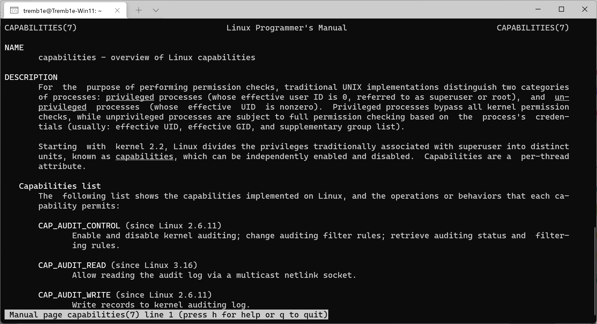
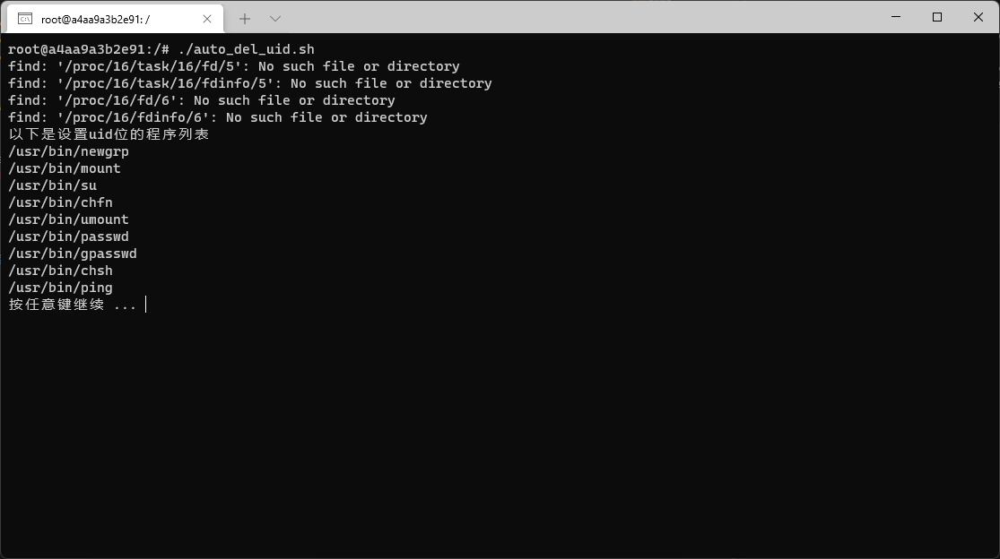
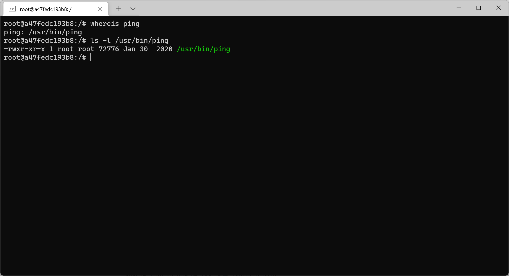

# 基于PAM的用户权能分配


## 1.指出每个权能对应的系统调用，简要解释功能

### 1.1 查询有哪些capacities

#### 1.1.1 使用man命令查询

```
$ man capabilities
```



#### 1.1.2 网站在线查询

完整列表如下：https://man7.org/linux/man-pages/man7/capabilities.7.html

网站对应以下内容：
- Capabilities list(本课程实验对应部分)
- Past and current implementation
- Notes to kernel developers
- Thread capability sets
- File capabilities
- File capability extended attribute versioning
- Transformation of capabilities during execve()
- Safety checking for capability-dumb binaries
- Capabilities and execution of programs by root
- Set-user-ID-root programs that have file capabilities
- Capability bounding set
- Effect of user ID changes on capabilities
- Programmatically adjusting capability sets
- The securebits flags: establishing a capabilities-only environment
- Per-user-namespace "set-user-ID-root" programs
- Namespaced file capabilities
- Interaction with user namespaces

.png)

### 1.2 Capabilities list内容解释

```
1.CAP_AUDIT_CONTROL (since Linux 2.6.11)            启用和禁用内核审计；更改审计过滤规则；检索审核状态和过滤规则。

2.CAP_AUDIT_READ (since Linux 3.16)                 允许通过一个多播netlink socket读取审计日志

3.CAP_AUDIT_WRITE (since Linux 2.6.11)              允许向内核审计日志写记录

4.CAP_BLOCK_SUSPEND (since Linux 3.5)               系统调用：epoll，可以阻塞系统挂起的特性

5.CAP_BPF (since Linux 5.8)                         使用特权 BPF 操作。 Linux 5.8 中添加了此功能，来将 BPF 功能与重载的 CAP_SYS_ADMIN 功能分开。

6.CAP_CHECKPOINT_RESTORE (since Linux 5.9)          Linux 5.9 中添加了此功能，以将检查点/恢复功能与重载CAP_SYS_ADMIN 功能分离。

7.CAP_CHOWN                                         系统调用：chown，对文件的UID和GID做任意的修改

8.CAP_DAC_OVERRIDE                                  忽略对文件的DAC访问限制

9.CAP_DAC_READ_SEARCH                               忽略DAC中对文件和目录的读、搜索权限

10.CAP_FOWNER                                       忽略忽略进程UID与文件UID的匹配检查

11.CAP_FSETID                                       文件修改时不清除setuid和setgid位，不匹配时设置setgid位

12.CAP_IPC_LOCK                                     锁定内存；使用大页面分配内存

13.CAP_IPC_OWNER                                    绕过对 System V IPC 对象的操作的权限检查

14.CAP_KILL                                         系统调用：kill，绕过发送信号时的权限检查，允许对不属于自己的进程发送信号

15.CAP_LEASE (since Linux 2.4)                      允许在文件上建立租借锁

16.CAP_LINUX_IMMUTABLE                              设置 FS_APPEND_FL 和 FS_IMMUTABLE_FL inode 标志

17.CAP_MAC_ADMIN (since Linux 2.6.25)               允许 MAC 配置或状态更改。为 Smack Linux 安全模块 (LSM) 实现。

18.CAP_MAC_OVERRIDE (since Linux 2.6.25)            覆盖强制访问控制 (MAC)。为 Smack LSM 实现。

19.CAP_MKNOD (since Linux 2.4)                      使用 mknod(2) 创建特殊文件

20.CAP_NET_ADMIN                                    允许执行网络管理任务：接口、防火墙和路由等

21.CAP_NET_BIND_SERVICE                             允许绑定到小于1024的端口，普通用户不能通过bind函数绑定到小于1024的端口，而CAP_NET_BIND_SERVICE可以让普通用户也可以绑定端口到1024以下

22.CAP_NET_BROADCAST                                允许网络广播和多播访问

23.CAP_NET_RAW                                      系统调用：socket，允许使用广元市套接字，原始套接字编程可以接收到本机网卡上的数据帧或者数据包，对监控网络流量和分析有很大的作用。

24.CAP_PERFMON (since Linux 5.8)                    采用各种性能监控机制，包括：* call perf_event_open(2);* 采用具有性能影响的各种 BPF 操作。Linux 5.8 中添加了此功能，以将性能监控功能与重载的 CAP_SYS_ADMIN 功能分开。

25.CAP_SETGID                                       系统调用：setgid，设置和管理进程GID

26.CAP_SETFCAP (since Linux 2.6.24)                 设置文件权能

27.CAP_SETPCAP                                      系统调用：capset，允许授予或删除其他进程的任何权能，只有init进程具有这种能力

28.CAP_SETUID                                       系统调用：setuid，设置和管理进程UID

29.CAP_SYS_ADMIN                                    允许执行系统管理任务，如挂载/卸载文件系统，设置磁盘配额，开/关交换设备和文件等

30.CAP_SYS_BOOT                                     系统调用：reboot，允许普通用户重新启动系统

31.CAP_SYS_CHROOT                                   系统调用：chroot，普通用户无法使用chroot()系统调用更改程序执行时所参考的根目录位置，而CAP_SYS_CHROOT可以给普通用户这个权限。

32.CAP_SYS_MODULE                                   系统调用：init_module，允许普通用户插入和删除内核模块

33.CAP_SYS_NICE                                     系统调用：nice，允许提升优先级，设置其他进程优先级

34.CAP_SYS_PACCT                                    系统调用：acct，允许普通用户配置进程记账

35.CAP_SYS_PTRACE                                   系统调用：ptrace，允许普通用户跟踪任何进程

36.CAP_SYS_RAWIO                                    允许对ioperm/iopl的访问

37.CAP_SYS_RESOURCE                                 系统调用：setrlimit，设置资源限制，但是普通用户不能用setrlimit来突破ulimit的限制

38.CAP_SYS_TIME                                     系统调用：stime，允许改变系统时钟

39.CAP_SYS_TTY_CONFIG                               系统调用：vhangup，允许配置TTY设备

40.CAP_SYSLOG (since Linux 2.6.37)                  系统调用：syslog，执行特权syslog(2)操作

41.CAP_WAKE_ALARM (since Linux 3.0)                 触发将唤醒系统的东西(设置 CLOCK_REALTIME_ALARM 和 CLOCK_BOOTTIME_ALARM 定时器)
```

## 2.基于PAM用户权限设置系统

实验环境：

- Windows 11 Pro
- WSL2
- Docker Desktop
- image:Ubuntu:latest


实验要求：

- 在某用户登录时，规定其只具有某几种权能。

实验流程：

- 新建三个用户：os_ping,os_passwd,os_none
- 找出并清除所有程序的权能
- 编写shell脚本，实现三个用户登录后可以执行不同的命令
- os_ping用户登录后只可以执行ping命令
- os_passwd用户登录后只可以执行passwd命令
- os_none登录后不可以执行任何命令

### 配置环境

容器为了最大程度减小镜像的大小，默认没有ping命令

```
root@a47fedc193b8:/# apt clean
root@a47fedc193b8:/# apt update
root@a47fedc193b8:/# apt install iputils-ping
```

### 2.1 新建三个用户

```
root@a47fedc193b8:/# useradd os_ping
root@a47fedc193b8:/# useradd os_passwd
root@a47fedc193b8:/# useradd os_none
```

### 2.2 找出并清除所有程序的权能

#### 2.2.1 找出所有程序的权能

```
root@a47fedc193b8:/# find / -perm /u=s   #或 find / -perm -4000
```



#### 2.2.1 清除所有程序的权能


### 2.3 查看ping命令的权能

```
root@a47fedc193b8:/# whereis ping
ping: /usr/bin/ping
root@a47fedc193b8:/# ls -l /usr/bin/ping
-rwxr-xr-x 1 root root 72776 Jan 30  2020 /usr/bin/ping
```



### 2.4 删除ping命令的权能


