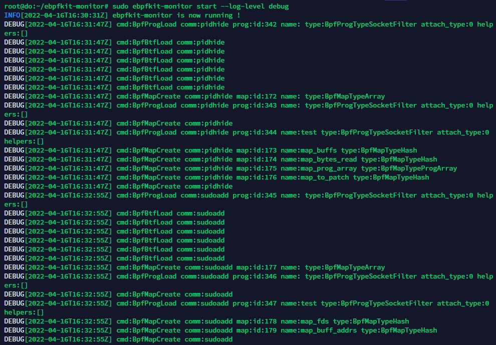

# Rootkit及检测实验

## 1.什么是Rootkit

### Rootkit优势

- 攻击者想要保持root权限以持续进行渗透
○ 即使凭证修改或漏洞修补后也能保持权限

- Hook系统调用表来获得查看信息和获得控制能力
○ 可以查看所有网络通信
○ 可以隐藏文件和进程
○ 创建root权限进程

### Rootkit劣势

- 小bug可能会内核崩溃
- 内核的更新可能会有风险
- 有些环境会禁止一些内核模块（比如 Amazon EKS）

## 2.eBPF介绍

“How about we add JavaScript-like capabilities to the Linux Kernel?”
   -- Thomas Graf, Isovalent, 2020

Isovalent 首席技术官兼联合创始人、eBPF 管理委员会主席 Thomas Graf 表示：“虽然 eBPF 已经被广泛部署并仍在快速发展中，但仍处于一个浪潮的开端，我们正在展望一个激动人心的未来，像 JavaScript 和其他语言对 Web 浏览器所做的那样，将 eBPF 看作是使操作系统可编程的方式。”

### eBPF技术允许用户在用户态编写代码，被verifier扫描鉴定无问题后，送入内核执行。

### eBPF技术能够在不修改内核代码的前提下，查看内核数据或修改内核功能。

### eBPF可以在Linux系统的各个地方插桩，在执行到指定位置时，执行用户自定的代码，实现数据的搜集和修改。

- eBPF (extended Berkeley Packet Filtering)
- Sandboxed programs in the Linux kernel
- eBPF allows you to create programmable trace points in the kernel
- Programs can be attached to:

○ Network Interfaces

○ Kernel functions

○ User mode functions

- eBPF programs are guaranteed to be:

○ Safe

○ Efficient

○ Portable

## 3.eBPF Rootkit相比传统Rootkit优势

- 不会使内核崩溃
- 最小的性能开销
- eBPF的安全并不是绝对的安全
○ 内核中存在一个Kernel eBPF Verifier
○ 只有特权进程才可以执行 bpf 系统调用
○ BPF 程序不能包含无限循环
○ BPF 程序不能导致内核崩溃
○ BPF 程序必须在有限时间内完成

## 4.eBPF Rootkit效果示例

在Black Hat 2021的峰会中，Datadog工程师Guillaume Fournier分享了[《With Friends Like eBPF, Who Needs Enemies?》](https://www.blackhat.com/us-21/briefings/schedule/#with-friends-like-ebpf-who-needs-enemies-23619) 介绍了eBPF的恶意利用，如何构建一个rootkit，入侵者会如何利用。 并把代码放在[https://github.com/Gui774ume/ebpfkit](https://github.com/Gui774ume/ebpfkit) 上，包括检测防御代码。

以及DEF CON29上的演讲

代码来源于DEF CON29峰会上安全研究员Pat Hogan分享的一篇关于eBPF的恶意利用案例：[《Warping Reality – creating and countering the next generation of Linux rootkits using eBPF》](https://defcon.org/html/defcon-29/dc-29-speakers.html#path) ，介绍了eBFP rootkit的应用场景，包括网络、运行时等，以及如何检测eBPF的恶意利用等。代码在[https://github.com/pathtofile/bad-bpf ](https://github.com/pathtofile/bad-bpf )。

以Hogan分享的一篇关于eBPF的恶意利用案例：[《Warping Reality – creating and countering the next generation of Linux rootkits using eBPF》](https://defcon.org/html/defcon-29/dc-29-speakers.html#path) 代码为例讲解

[https://github.com/pathtofile/bad-bpf ](https://github.com/pathtofile/bad-bpf )

bad-bpf编译出的可执行文件

### 4.1 隐藏进程

#### pidhide 程序通过hook getdents64 系统调用来取消与PID相关联的 /proc/ 文件夹的链接，而 ps 是通过查找 /proc/ 中的每个子文件夹工作的。

#### 4.1.1 查看原始进程

 docker 运行了 ubuntu 镜像的 “/bin/bash”命令，进程 pid 为19538

#### 4.1.2 运行eBPF Rootkit

运行 eBPF Rootkit 后，查看进程

查看 /proc 文件夹

#### 4.1.3 隐藏进程Rootkit检测

这种简单的 hook 方式会被常用的 Rootkit 检测工具检查出来，如 chkrootkit

### 4.2 劫持新建进程

#### exechijack 程序会劫持所有用于创建新进程的 execve 系统调用，转而调用 /a ：只输出 uid 和 argv[0] 

#### 4.2.1 运行 eBPF Rootkit

多命令同时使用时成功率较高

#### 4.2.2 劫持进程Rootkit检测

此时由于新建进程都会被劫持，所以无法启动 chkrootkit 检测程序
改进：可以对于常见的 Rootkit 检测程序，可以定制化启动为虚假检测程序，来骗过用户

### 4.3 低权限用户提权

该程序允许通常低权限的用户使用 sudo 成为 root。

它的工作原理是拦截 sudo 对 /etc/sudoers 文件的读取，并用 <username> ALL=(ALL:ALL) NOPASSWD:ALL # 覆盖第一行。这使 sudo 认为用户被允许成为 root。其他程序（例如 cat 或 sudo edit）不会受到影响，因此对于这些程序，文件不会更改，并且用户没有这些权限。行尾的 # 确保该行的其余部分被视为注释（有sql注入的味道），因此它不会破坏文件的逻辑。

#### 4.3.1 查询用户权限

查询 lowpriv-user 在本机是否拥有 sudo 权限

#### 4.3.2 运行eBPF Rootkit

运行后，lowpriv-user 用户可以暂时成为root用户

#### 4.3.3 用户暂时提权Rootkit检测

未能检测出明显问题

## 5. eBPF Rootkit的检测手段

### 5.1 Datadog的方法

#### 5.1.1 从源码入手

根据GPL协议要求代码开源，并查看源码中的敏感 eBPF 调用

#### 5.1.2 构建工具

使用工具“ebpfkit-monitor”

ebpfkit-monitor 是一个可用于静态分析 eBPF 字节码或在运行时监控可疑的 eBPF 活动的程序。它是专门为检测 ebpfkit 而设计的。

##### clang/llvm编译生成的target为bpf的ELF文件，使用load_bpf_file函数加载进入内核

因此 ebpfkit-monitor 侧重于分析 ELF 文件

### 5.2 pathtofile的方法

### 5.2.1 禁用所有的eBPF调用

优点：安全
缺点：需要重新编译内核，关闭eBPF，会缺失很多功能，且不一定都适用

示例如下

该程序向任何尝试使用 ptrace 系统调用的程序发出 SIG_KILL 信号，例如 strace

### 5.2.2 对eBPF代码进行签名

优点：对 eBPF 代码进行签名会防止 eBPF 的滥用，并加强安全性
缺点：对JIT编译器有要求

## 6. 参考资料

- [https://www.cnxct.com/evil-use-ebpf-and-how-to-detect-ebpf-rootkit-in-linux/](https://www.cnxct.com/evil-use-ebpf-and-how-to-detect-ebpf-rootkit-in-linux/)

- [https://www.blackhat.com/us-21/briefings/schedule/#with-friends-like-ebpf-who-needs-enemies-23619](https://www.blackhat.com/us-21/briefings/schedule/#with-friends-like-ebpf-who-needs-enemies-23619)

- [https://github.com/Gui774ume/ebpfkit](https://github.com/Gui774ume/ebpfkit)

- [https://github.com/Gui774ume/ebpfkit-monitor](https://github.com/Gui774ume/ebpfkit-monitor)

- [https://github.com/pathtofile/bad-bpf ](https://github.com/pathtofile/bad-bpf )

- [https://defcon.org/html/defcon-29/dc-29-speakers.html#fournier](https://defcon.org/html/defcon-29/dc-29-speakers.html#fournier)

- [https://defcon.org/html/defcon-29/dc-29-speakers.html#path](https://defcon.org/html/defcon-29/dc-29-speakers.html#path)

- [https://www.youtube.com/watch?v=Q8eY67hDvkc](https://www.youtube.com/watch?v=Q8eY67hDvkc)

- [https://www.youtube.com/watch?v=5zixNDolLrg](https://www.youtube.com/watch?v=5zixNDolLrg)

- [https://www.youtube.com/watch?v=g6SKWT7sROQ](https://www.youtube.com/watch?v=g6SKWT7sROQ)
